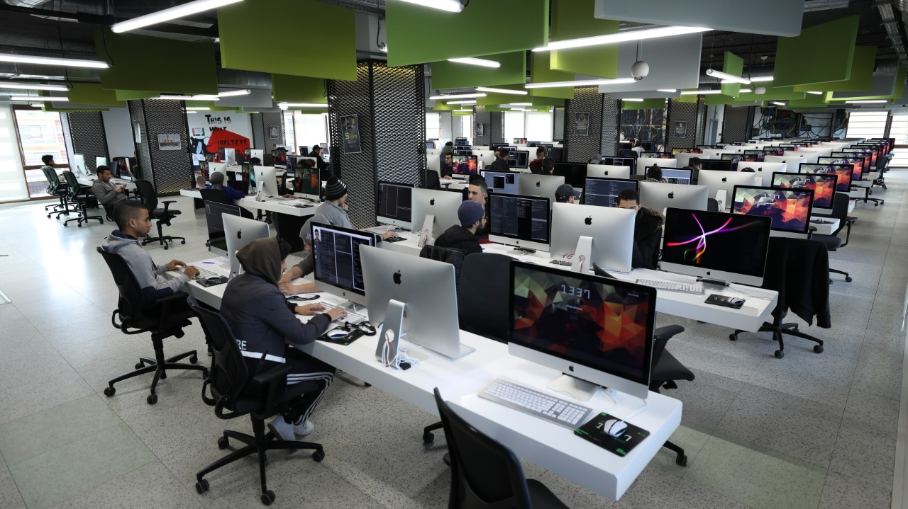

# 42Cursus
## 👋, This repository has my 42 common core projects developed at <a href="https://1337.ma/">1337 coding school.</a>

## 🗣️ About 42

	42 is a global education initiative that offers a new way of learning technology:
	no teachers, no classrooms, students learning from their fellow students (peer to peer
	learning), with a methodology that develops both computing and life skills. The 42 cursus is
	free for whoever is approved in its selection process* - the so-called "Piscine" - becoming
	thus "cadets" (42's students).

\* For further information about 42's **selection process** (the "Piscine"), please visit the [The Pool](https://1337.ma/en/the-pool/).

 

